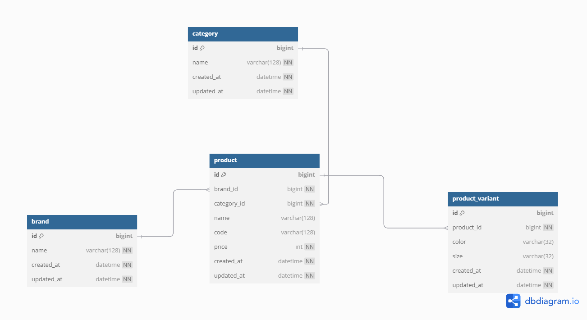

# MUSINSA 백엔드 엔지니어 과제

## 1. 구현 범위에 대한 설명

이 프로젝트는 MUSINSA 백엔드 엔지니어 과제 요구사항에 따라 아래 네 가지 기능을 구현하였습니다.

1. **카테고리별 최저가 조회:**  
   각 카테고리에서 최저 가격을 제공하는 브랜드와 해당 상품의 가격, 그리고 전체 최저가 총액을 조회하는 API를 구현하였습니다.

2. **단일 브랜드 최저 총액 조회:**  
   하나의 브랜드로 모든 카테고리의 상품을 구매할 경우, 최저 총액과 각 카테고리 별 상품 가격을 확인할 수 있는 API를 구현하였습니다.

3. **특정 카테고리 최저 및 최고 가격 조회:**  
   고객이 특정 카테고리명을 입력하면 해당 카테고리에서 최저, 최고 가격의 브랜드와 각 상품의 가격을 조회할 수 있도록 하였습니다.

4. **브랜드 및 상품 관리:**  
   운영자가 새로운 브랜드를 등록하고, 모든 브랜드의 상품을 추가, 수정, 삭제할 수 있는 CRUD API를 구현하였습니다.

추가로, 간단한 프론트엔드 페이지와 Swagger UI를 통해 API 테스트 및 확인을 할 수 있도록 구현하였습니다. 프로젝트 실행 후 다음 URL에서 확인할 수 있습니다:

- Swagger UI: API 문서는 http://localhost:8080/swagger-ui/index.html 에서 확인할 수 있습니다.

- 프론트엔드 페이지: 간단한 프론트엔드 페이지는 http://localhost:8080/index.html 에서 확인할 수 있으며, 카탈로그(구현 1, 2, 3), 브랜드 및 상품 관리 기능을 제공합니다.

### DB Schema Diagram



## 2. Tech Stack

- **Java:** 21
- **Spring Boot:** 3.4.4
- **Spring JPA**
- **jOOQ**
    - jOOQ를 사용하는 이유: Type-safe raw SQL 쿼리를 작성하기 위해 사용합니다.
- **Flyway**
- **H2 Database**
- **Gradle**

## 3. 코드 빌드, 테스트 및 실행 방법

### 빌드 및 테스트
- 본 프로젝트는 **Gradle**을 사용하여 빌드합니다.

빌드 및 테스트

```bash
./gradlew clean build
```

테스트만 실행

```bash
./gradlew test
```

애플리케이션 실행

```bash
./gradlew bootRun
```